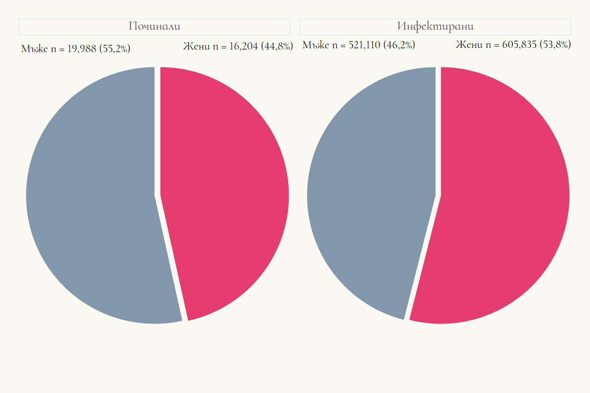

```{r setup, include=FALSE}
knitr::opts_chunk$set(echo = TRUE)
```

```{r pakeges, include=FALSE}
library(tidyverse)
library(easystats)
library(tayloRswift)
library(readr)
library(officer)
library(janitor)
library(flextable)
library(apyramid)
library(rstatix)
library(gtsummary)
Sys.setlocale(locale = "Bulgarian")
```

```{r read_data, include=FALSE}
cov = read_csv("C:\\\\Users\\PC\\Desktop\\covid_full.csv", 
    col_types = cols(exam_date = col_date(format = "%d.%m.%Y"), 
         lastvac_date = col_date(format = "%d.%m.%Y"), 
         start_hospis = col_date(format = "%d.%m.%Y"), 
         end_hospis = col_date(format = "%d.%m.%Y")))
cov = as_tibble(cov)

dth <- read_csv("https://raw.githubusercontent.com/kostadinoff/COVID-19-MH/master/data/COVID_MH_data/deaths.csv", col_types = cols(add_day = col_date(format = "%Y-%m-%d"), 
    death_day = col_date(format = "%Y-%m-%d")))
dth = as_tibble(dth)
```

# Описателен анализ (дискриптивна статистика)

## Разпределние по възраст:

В предоставения масив от данни са са налични 1 126 945 записа на официално потвърдени и регистрирани случаи с коронавирусна инфекция. Средната възраст на анализираните е 47,92 год. (SD = 19,29). Величината е нормално разпределена. Медианата на възрастта сред включените пациенти е 48 год (IQR = 29). Коефициентът на вариация на възрастта в предоставените данни е 40,26%.

```{r age_infected, echo=FALSE}

age = cov %>% 
      get_summary_stats(
      age,  # columns to calculate for
      type = "common") %>% 
      flextable()
age  

```

При починалите пациенти с установена коронавирусна инфекция (n = 36 192) средната възраст е 71,52 г. (SD = 11,58), като и сред тази група величината е нормално разпределена. Медианата на възрастта е 73г. (IQR = 15). В тази подгрупа коефициентът на вариация е 16%, което определя вариабилността на възрастта в групата с 24,26 процентни пункта по-малко спрямо всички инфектирани.

```{r age_death, echo=FALSE}
age_dth = dth %>% 
          get_summary_stats(
          age,  # columns to calculate for
          type = "common") %>% 
          flextable()
age_dth
```

## Разпределние по пол:



По отношение на половото разпределние - сред инфектираните преобладават жени (n = 605 835, 53,8%), като половото съотношение мъже:жени е 0,86.

```{r gender_infected, echo=FALSE}
gender = cov %>% 
      freq_table(gender) %>% 
      flextable()
gender
```

В подгрупата на починали пациенти половото съотношение е в полза на мъжкия пол 1,24 като починалите мъже представляват 55,2 % от групата на починалите.

```{r gender_death, echo=FALSE}
gender_dth = dth %>% 
      freq_table(sex) %>% 
      flextable()
gender_dth
```

## Разпределние по възрастови групи:

По възрастови групи, в най-голяма степен са представени инфектираните в диапазона 45-54 г. (18,3%), което отговаря напълно и на разпределнието на населението в Р.България (НСИ).

```{r age_groups_inf, echo=FALSE}
cov$age = as.numeric(cov$age)

cov["age_group"] = cut(cov$age, c(0, 14, 24,34, 44, 54, 64, 74, 84, 94, Inf), 
                       c("0-14","15-24","25-34","35-44","45-54","55-64",
                         "65-74","75-84","85-94","> 95"), include.lowest=TRUE)

age_groups =  cov %>% 
              freq_table(age_group) %>% 
      flextable()
age_groups
```

Сред починалите, в най-голяма степен е представена възрастовата група 65-74г. (33,3%).

```{r age_groups_death, echo=FALSE}
dth$age = as.numeric(dth$age)

dth["age_group"] = cut(dth$age, c(0, 14, 24,34, 44, 54, 64, 74, 84, 94, Inf), 
                       c("0-14","15-24","25-34","35-44","45-54","55-64",
                         "65-74","75-84","85-94","> 95"), include.lowest=TRUE)

age_groups_dth =  dth %>% 
              freq_table(age_group) %>% 
              flextable()
age_groups_dth
```

Интерест представлява и съотношението на починали спрямо инфектирани във всяка от възрастовите групи. Изислено е на базата на починали върху заразени \* 100. Наблюдава се тренд в съотношението с нарастване на възрастта, като най-виски приръсти в това съотношение се наблюдават във възрастовите групи над 65 години.

```{r group_ratio, echo=FALSE}

age_groups_all =  cov %>% 
              freq_table(age_group) %>% 
              mutate(death = "no") %>% 
              mutate(n_all=n) %>% 
              select(age_group, n_all)
age_groups_death =  dth %>% 
              freq_table(age_group) %>% 
              mutate(death = "yes") %>% 
              mutate(n_death=n) %>% 
              select(age_group, n_death)
             

age_summ = age_groups_all %>% 
              inner_join(age_groups_death) %>% 
               mutate(ratio = (n_death/n_all)*100) %>% 
               mutate(diff = ratio-lag(ratio)) %>% 
               select(age_group,ratio,diff) %>% 
               flextable()


age_summ
```

## Двумерно разпределние - по възраст и пол:

При двумерно разпределение по възраст и пол сред инфектираните се установява по-висок относителен дял на инфектираните мъже в диапазона 35-44 год., докато при женсия пол най-представена е групата на инфектирани в диапазона 45-54г. 


```{r sex_age, echo=FALSE}
age_gender = cov %>%                          # case linelist
  tabyl(age_group, gender) %>%                # cross-tabulate counts
  adorn_totals(where = "row") %>%             # add a total row
  adorn_percentages(denominator = "col") %>%  # convert to proportions
  adorn_pct_formatting() %>%                  # convert to percents
  adorn_ns(position = "front") %>%            # display as: "count (percent)"
  flextable()
  age_gender
```

В групата на починалите има аналогична тенденция с изместване на 2 декади в смъртността. При женския под най-висок относителен дял на починали са наблюдават в диапазона 75-84 (34,6%), докато при мъжете с най-висок относителен дял са тези починали на възраст в диапозна декада по-рано 65-74 (33,9%)

```{r sex_age_dth, echo=FALSE}
age_gender_dth = dth %>%                          # case linelist
  tabyl(age_group, sex) %>%                # cross-tabulate counts
  adorn_totals(where = "row") %>%             # add a total row
  adorn_percentages(denominator = "col") %>%  # convert to proportions
  adorn_pct_formatting() %>%                  # convert to percents
  adorn_ns(position = "front") %>%            # display as: "count (percent)"
  flextable()
age_gender_dth
```


```{r echo=FALSE}
piramid = apyramid::age_pyramid(data = cov,
                      age_group = "age_group",
                      split_by = "gender",
                      proportional = TRUE)
piramid 
```

```{r echo=FALSE}
piramid_dth = apyramid::age_pyramid(data = dth,
                      age_group = "age_group",
                      split_by = "sex",
                      proportional = TRUE)
piramid_dth
```

```{r include=FALSE}
vac_piramid=apyramid::age_pyramid(data = cov,
                      age_group = "age_group",
                      split_by = "is_f_vac")  
```

```{r include=FALSE}
pop_data <- cov %>% 
    group_by(gender, age_group) %>% 
    summarise(counts=n()) %>% 
    mutate(
    percent  = round(100*(counts / sum(counts, na.rm=T)),1),  # % of total
    percent  = case_when(                                                        
     gender == "F" ~ percent,
     gender == "M" ~ -percent,               # if male, convert % to negative
     TRUE          ~ NA_real_))

case_data <- dth %>% 
    group_by(sex, age_group) %>% 
    mutate(sex = recode(sex, "жена" = 'F', "мъж" = 'M')) %>% 
    summarise(counts=n()) %>% 
    mutate(
    percent  = round(100*(counts / sum(counts, na.rm=T)),1),  # % of total
    percent  = case_when(                                                        
      sex == "F" ~ percent,
     sex == "M" ~ -percent,               # if male, convert % to negative
     TRUE          ~ NA_real_)) %>% 
  rename(gender = sex)
```

```{r include=FALSE}
# combine case and population data (same column names, age_cat values, and gender values)
pyramid_data <- bind_rows("cases" = case_data, "population" = pop_data, .id = "data_source")
# Define extent of percent axis, used for plot limits
max_per <- max(pyramid_data$percent, na.rm=T)
min_per <- min(pyramid_data$percent, na.rm=T)
```

```{r include=FALSE}
age_levels <- c("0-14","15-24","25-34","35-44","45-54","55-64",
                         "65-74","75-84","85-94","> 95")
```

```{r echo=FALSE}
# begin ggplot
##############
bi_plot = ggplot()+  # default x-axis is age in years;

  # population data graph
  geom_col(
    data = pyramid_data %>% filter(data_source == "population"),
    mapping = aes(
      x = age_group,
      y = percent,
      fill = gender),
    colour = "black",                               # black color around bars
    alpha = 0.2,                                    # more transparent
    width = 1)+                                     # full width
  
  # case data graph
  geom_col(
    data = pyramid_data %>% filter(data_source == "cases"), 
    mapping = aes(
      x = age_group,                              # age categories as original X axis
      y = percent,                                # % as original Y-axis
      fill = gender),                             # fill of bars by gender
    colour = "black",                           # black color around bars
    alpha = 1,                                      # not transparent 
    width = 0.3)+                                   # half width
  
  # flip the X and Y axes to make pyramid vertical
  coord_flip()+
  
  # manually ensure that age-axis is ordered correctly
  scale_x_discrete(limits = age_levels)+     # defined in chunk above
  
  # set percent-axis 
  scale_y_continuous(
    limits = c(min_per, max_per),                                          # min and max defined above
    breaks = seq(floor(min_per), ceiling(max_per), by = 2),                # from min% to max% by 2 
    labels = paste0(                                                       # for the labels, paste together... 
              abs(seq(floor(min_per), ceiling(max_per), by = 2)), "%"))+                                                  

  # designate colors and legend labels manually
  scale_fill_manual(
    values = c("F" = "pink",         # assign colors to values in the data
               "M" = "darkblue"),
    labels = c("F" = "Жени",
               "M"= "Мъже"),      # change labels that appear in legend, note order
  ) +

  # plot labels, titles, caption    
  labs(
    title = "Възрастова и полова структура на починалите спрямо инфектираните",
    subtitle = "",
    x = "Група",
    y = "%",
    fill = NULL,
    caption = stringr::str_glue("Данните за починалите включват периода \nот: {format(min(dth$add_day, na.rm=T), '%d %b %Y')} до {format(max(dth$add_day, na.rm=T), '%d %b %Y')}")) +
  
  # optional aesthetic themes
  theme(
    legend.position = "bottom",                             # move legend to bottom
    panel.grid.major = element_blank(),
    panel.grid.minor = element_blank(),
    panel.background = element_blank(),
    axis.line = element_line(colour = "black"),
    plot.title = element_text(hjust = 0), 
    plot.caption = element_text(hjust=0, size=12, face = "italic"))
bi_plot
```

## Разпределение по област:

По отношение на областта, очаквано спрямо данните от НСИ за разпределението на населението по области най-висок относителен дял се наблюдава в област София (столица) - 25,4% регистрирани, следвани от област Пловдив 9% и област Варна 8,4%. По отношение на починалите се запазва най-високия относителен дял на област София (столица) с  12,8 %, следвана от област Пловдив 9,3%. Най-високо съотношение на леталитета (починали сред инфектирани) по области се наблюдава за Разград 6,10 %, а най-нисък за област София (столица) 1,6%. 

/// TODO карта на леталитета 
```{r province_inf, echo=FALSE}
province_inf = cov %>% 
      freq_table(province) %>% 
      mutate(region=province,
             n_infected = n,
             prop_infected=prop) %>% 
      select(region, n_infected, prop_infected)
province_dth = dth %>% 
      freq_table(nuts2) %>% 
      mutate(region = nuts2,
             n_death = n,
             prop_death = prop) %>% 
      select(region, n_death, prop_death)
province = province_inf %>% 
  inner_join(province_dth) %>% 
  mutate(ratio = (n_death/n_infected)*100) %>% 
  flextable()
province  
```

## Разпределение според хоспитализация: 
Сред регистрираните пациенти, данни за хоспитализация е налична при 22% от случаите. Установена е асоциация между възрастовата група и съотношението на хоспитализираните пациенти. Най-висок относителен дял на хоспитализирани се установява във възрастовата група 75-84г. 

```{r place, echo=FALSE}
place = cov %>% 
      mutate(hospital_treat = if_else(is.na(start_hospis), "Home", "Hospital")) %>% 
      freq_table(age_group,hospital_treat) %>% 
      flextable()
place
```

Прави впечатление, че с намаляването на възрастовата група, намалява и относителния дял на хоспитализираните с изключение на детската възраст от 0 до 14 г, който е с 5,1 процентни пункта по-висок спрямо този на възрастовата група 15-24г. Хоспитализацията при мъжете (24,1%) се установява статистически по-висока спрямо тази при жените (20.1%)

```{r place_2, echo=FALSE}
place_2 = cov %>% 
      mutate(hospital_treat = if_else(is.na(start_hospis), "Home", "Hospital")) %>% 
      freq_table(gender,hospital_treat) %>% 
      flextable()
place_2
```

По области най-висок относителен дял на хоспитализирани се установява в Разград 40,1% и област Смолян 40,9 %

//TODO: Карта с хоспитализирани по области
//TODO piechart по пол/област и хоспитализация 
```{r place_3, echo=FALSE}

place_3 = cov %>% 
      mutate(hospital_treat = if_else(is.na(start_hospis), "Home", "Hospital")) %>% 
      freq_table(province,hospital_treat) %>% 
      flextable()
place_3
```

## Разпределение по ваксинационен статус
### Поне една поставена доза

С поне една поставена доза са 26,6 % от всички регистрирани. При хоспитализираните с поне една доза са 17,6 %, което е с 5,9 процентни пунтка по-малко спрямо групата на неваксинираните (хоспитализация при 23,5%) 

```{r vax_1, echo=FALSE}
vax_status_1 = cov %>% 
      mutate(hospital_treat = if_else(is.na(start_hospis), "Home", "Hospital")) %>% 
      mutate(vax_status = if_else(is.na(vaccine_name), "No_vax", "Vax")) %>%
       freq_table(vax_status,hospital_treat) %>% 
       flextable()
vax_status_1
```

С 1,1 процентни пунта ваксинацията е застъпена в по-голяма степен при инфектираните мъже (27,2%). Сред всички инфектирани спрямо ваксинационния статус преобладават неваксинираните жени (73,9%)

```{r vax_2, echo=FALSE}
vax_status_2 = cov %>% 
      mutate(hospital_treat = if_else(is.na(start_hospis), "Home", "Hospital")) %>% 
      mutate(vax_status = if_else(is.na(vaccine_name), "No_vax", "Vax")) %>%
       freq_table(gender,vax_status) %>% 
       flextable()
vax_status_2
```

Сред инфектираните, най-висок относителен дял на неваксинирани се установява в област Монтана 83,7% и област Смолян 82,8%. 
```{r vax_3, echo=FALSE}
vax_status_3 = cov %>% 
      mutate(vax_status = if_else(is.na(vaccine_name), "No_vax", "Vax")) %>%
       freq_table(province,vax_status) %>% 
       flextable()
vax_status_3
```

## Двумерно разпределние спрямо ваксинационен статус (поне една доза) и изход от инфекцията

Установява се асоциация между ваксинационния статус и изхода при инфектираните. Въпреки, че медианата на възрастта в групата на ваксинираните е с 3.9 години по-висока от тази на неваксинираните, починалите в тази група са с 20 % по-малко спрямо неваксинираните. Разликата между медианата на възрастта в двете групи на починали и възстановени е 25 години. 

```{r vax_death, echo=FALSE}
exit_1 <- cov %>% 
      mutate(hospital_treat = if_else(is.na(start_hospis), 0, 1)) %>% 
      mutate(vaccinated = if_else(is.na(vaccine_name), 0, 1)) %>% 
      mutate(death = if_else(is.na(outcome_covid), "Recovery", "Death")) %>%
      mutate(male = ifelse(gender == "F" ,0,1)) %>% 
     select(vaccinated,hospital_treat,male,death,age) %>% 
tbl_summary(
            by = death, # split table by group
            missing = "no" ) %>%
            add_n() %>% # add column with total number of non-missing observations
            add_difference() %>% 
            as_flex_table()
exit_1 
```


