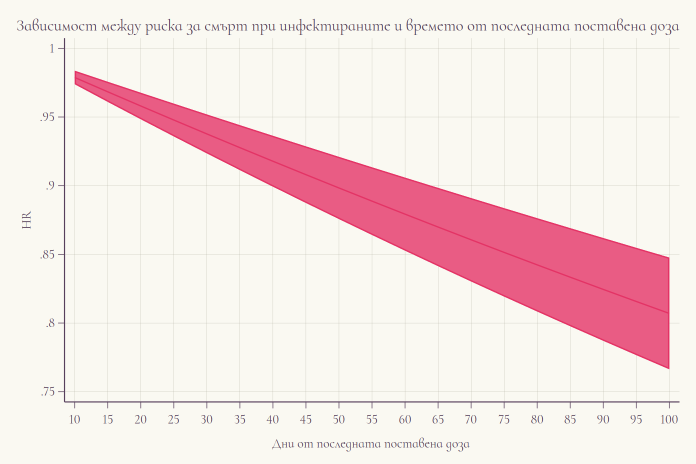

```{r setup, include=FALSE}
knitr::opts_chunk$set(echo = TRUE)
```


```{r pakeges, include=FALSE}
library(tidyverse)
library(easystats)
library(tayloRswift)
library(readr)
library(officer)
library(janitor)
library(flextable)
library(apyramid)
library(rstatix)
library(gtsummary)
library(arsenal)
library(gt)
library(emmeans)
library(chisq.posthoc.test)
Sys.setlocale(locale = "Bulgarian")
```

# Сравнителен анализ на оздравели и починали.

В предоставената базата данни, за периода са осъществени 247 441 хоспитализиции. Общо хоспитализираните са 22% от всички регистрирани инфектирани. По-висок относителен дял на хоспитализираните се наблюдава при мъжете 50,7% спрямо жените 49,3%. По отношение на възрастовото разпределение : средната възраст при нехоспитализираните е 43,9 (SD = 18.0), докато при приетите в болница 62,2 (SD = 16.9), като разликата във възрастта е статистически значима (p\<0.001)

```{r read_data, include=FALSE}
cov = read_csv("C:\\\\Users\\PC\\Desktop\\covid_full.csv", 
    col_types = cols(exam_date = col_date(format = "%d.%m.%Y"), 
         lastvac_date = col_date(format = "%d.%m.%Y"), 
         start_hospis = col_date(format = "%d.%m.%Y"), 
         end_hospis = col_date(format = "%d.%m.%Y")))
cov = as_tibble(cov)

dth <- read_csv("https://raw.githubusercontent.com/kostadinoff/COVID-19-MH/master/data/COVID_MH_data/deaths.csv", col_types = cols(add_day = col_date(format = "%Y-%m-%d"), 
    death_day = col_date(format = "%Y-%m-%d")))
dth = as_tibble(dth)
```

```{r data_prepare, include=FALSE}
cov = cov %>% 
  mutate(status = if_else(is.na(outcome_covid), "R", "D")) %>% 
  mutate(hospital_treat = ifelse(is.na(start_hospis), "Home", "Hospital")) %>% 
  mutate(wave = case_when(exam_date <='2021-01-23'~ "original_strain",
                          exam_date > '2021-01-23' & exam_date <= '2021-07-07' ~ "alpha",
                          exam_date > '2021-07-07' & exam_date <= '2022-01-26' ~ "delta",
                          exam_date > '2022-01-26'~ "omicron")) %>% 
  mutate(time_to_event = case_when(hospital_treat == "Hospital" ~difftime(start_hospis, exam_date, units = "days"),
                                       
                                   hospital_treat == "Home" ~ 0)) %>%
  mutate(time_in_hospital = case_when(hospital_treat == "Hospital" ~difftime(end_hospis, start_hospis, units = "days"),
                                       
                                   hospital_treat == "Home" ~ 0)) %>%
  mutate(time_to_event = as.numeric(time_to_event)) %>% 
  mutate(time_in_hospital = as.numeric(time_in_hospital)) %>% 
  mutate(vax_status = if_else(is.na(vaccine_name), "No_vax", "Vax")) %>% 
  mutate(vac_status = case_when(vax_status == "Vax" & lastvac_date < exam_date ~ "Vax",
                                TRUE ~ "No_vax")) %>% 
  dplyr::select(-vax_status) %>% 
  mutate(time_after_vax = case_when(vac_status == "Vax" ~ difftime(exam_date,lastvac_date, units = "days"),
                                       
                                   vac_status == "No_vax"  ~ 0)) %>% 
  mutate(time_after_vax = as.numeric(time_after_vax)) 
  
cov$time_to_event <- replace(cov$time_to_event, cov$time_to_event <= 0 & cov$hospital_treat == "Home" , NA)      
cov$time_to_event <- replace(cov$time_to_event, cov$time_to_event < 0, NA) 
cov$time_after_vax <- replace(cov$time_after_vax, cov$time_after_vax < 0, NA)      
cov$time_in_hospital <- replace(cov$time_in_hospital, cov$time_in_hospital <= 0, NA) 
cov["age_group"] = cut(cov$age, c(0, 14, 24,34, 44, 54, 64, 74, 84, 94, Inf), 
                       c("0-14","15-24","25-34","35-44","45-54","55-64",
                         "65-74","75-84","85-94","> 95"), include.lowest=TRUE)
```

# Характеристика на инфектираните според вариантите

Наблюдава се и статистически значима асоциация между вариантите (определени по датата с съобщени от НЦЗПЗ с над 50% преобладаващ щам в изследваните проби) и относителния дял на **хоспитализираните.** В най-голям относителен дял се наблюдават хоспитализирани в началото на пандемията с преобладаващият оригинален вариант и алфа вариант на SARS-CoV-2. Вероятно това се дължи на въведените в този период противоепидемични мерки, налагащи задължителна изолация чрез хоспитализирания на рискови групи от населението. 

Най-висок **леталитет** се наблюдава в периода на разпространение на алфа и делта вариантите (за алфа 4,2%, за делта 4,1%). Най-нисък (отново вероятно поради най-строгите противоепидемични мерки в началото на пандемията)


```{r  echo=FALSE}
hospitalis_all = cov %>% 
  dplyr::select(vac_status,status,wave,gender, age, hospital_treat) %>% 
  mutate(male = ifelse(gender=="M",1,0)) %>% 
  mutate(hospitalized = ifelse(hospital_treat=="Hospital",1,0)) %>% 
  mutate(vacinated = ifelse(vac_status =="Vax",1,0)) %>% 
  mutate(case_fatality = ifelse(status == "R",0,1)) %>% 
  dplyr::select(age,wave,male,hospitalized,vacinated,case_fatality ) %>% 
  tbl_summary(
    by = wave,
    statistic = list(all_continuous() ~ "{mean} ({sd})",
                     all_categorical() ~ "{n} / {N} ({p}%)")) %>% 
  add_p() %>% 
  as_flex_table()
  
hospitalis_all
```

# Характеристика на преболедувалите според вариантите на вируса.

Разгледано в групата на *преболедувалите*, най-висока е медианата на възрастта в периода на алфа варианта (52 год.), а най-ниска в при делта варианта (44 год.)


```{r  echo=FALSE}
hospitalis_R = cov %>%
  filter(status== "R") %>% 
  dplyr::select(vac_status,wave,gender, age, hospital_treat) %>% 
  mutate(male = ifelse(gender=="M",1,0)) %>% 
  mutate(hospitalized = ifelse(hospital_treat=="Hospital",1,0)) %>% 
  mutate(vacinated = ifelse(vac_status =="Vax",1,0)) %>% 
  dplyr::select(age,wave,male,hospitalized,vacinated) %>% 
  tbl_summary(
    by = wave,
    statistic = list(all_continuous() ~ "{mean} ({sd})",
                     all_categorical() ~ "{n} / {N} ({p}%)")) %>% 
  add_p() %>% 
  as_flex_table()
  
hospitalis_R
```

# Характеристика на починалите според вариантите на вируса.

В групата на **починалите** най-висока медиана на средната възраст се наблюдава в периода на разпространение на омикрон варианта (76 г.). Най-голям относителен дял на мъжете сред починалите инфектирани се наблюдава в началото на пандемията при разпространение на *оригиналния* вариант. 


```{r  echo=FALSE}
hospitalis_D = cov %>%
  filter(status== "D") %>% 
  dplyr::select(vac_status,wave,gender, age, hospital_treat) %>% 
  mutate(male = ifelse(gender=="M",1,0)) %>% 
  mutate(hospitalized = ifelse(hospital_treat=="Hospital",1,0)) %>% 
  mutate(vacinated = ifelse(vac_status =="Vax",1,0)) %>% 
  dplyr::select(age,wave,male,hospitalized,vacinated) %>% 
  tbl_summary(
    by = wave,
    statistic = list(all_continuous() ~ "{mean} ({sd})",
                     all_categorical() ~ "{n} / {N} ({p}%)")) %>% 
  add_p() %>% 
  as_flex_table()
  
hospitalis_D
```


# Характеристика на инфектираните спред хоспитализацията. 

Според фактор- хоспитализация се установяват следните статистически значими различия: 

- Медианата на възрастта при хоспитализираните ковид - заразени е с 18 години по-висока спрямо пациентите на домашно лечение. Мъжете са хоспитализирани в по-висок относителен дял спрямо жените (разлика 5,7%). 

- Хоспитализираните ваксинирани са с 8% по-малко спрямо ваксинираните на домашно лечение. Леталитетът при пациентите на домашно лечение е 0,1% спрямо 13% леталитет при хоспитализираните


```{r  echo=FALSE}
hospitalis_hos = cov %>%
  dplyr::select(hospital_treat,vac_status,wave,gender, status,age) %>% 
  mutate(male = ifelse(gender=="M",1,0)) %>% 
  mutate(vacinated = ifelse(vac_status =="Vax",1,0)) %>% 
  mutate(case_fatality = ifelse(status == "R",0,1)) %>% 
  dplyr::select(hospital_treat,age,male,vacinated,case_fatality) %>% 
  tbl_summary(
    by = hospital_treat,
    statistic = list(all_continuous() ~ "{mean} ({sd})",
                     all_categorical() ~ "{n} / {N} ({p}%)")) %>% 
  add_difference() %>% 
  as_flex_table()
  
hospitalis_hos
```

Нестандартизираният леталитет при ваксинираните за целия изследван период е 1,6; спрямо 3,1 при неваксинираните пациенти (разлика 1.5%) 

```{r  echo=FALSE}
procent_death = 
  cov %>% 
  select(status, vac_status) %>% 
  mutate(case_fatality = ifelse(status == "R",0,1)) %>% 
  select(-status) %>% 
  tbl_summary(
    by  = vac_status
  ) %>% 
  add_difference() %>% 
  as_flex_table()
  

procent_death
```

# Характеристика на инфектираните спрямо областите 

  По отношение на разпределение по области се наблюдава статистическа значима асоциация между областта и относителния дял на хоспитализираните, като най-висок се наблюдава в област Смолян (40,9%), а най-нисък в област София (столица) 12,6 %

```{r include=FALSE}
cov = cov %>% 
  mutate(comp_outcome = case_when(hospital_treat == "Home" ~ "Recovery",
                                  status == "D" ~ "Death",
                                  TRUE ~ "Hospitalized"))
```

  По отношение на областното разпределение в таблицата по-долу е представена информация за разликата между относителните дялове на ваксинираните и неваксинираните сред починалите и хоспитализираните. 
  Най-висока разлика по отношение на хоспитализициятата се наблюдава в област Смолян, където хоспитализираните неваксинирани са с 18,6 процентни повече спрямо ваксинираните. За област Монтана ваксинацията е довела до 2,2 процента спад в леталитеа. Най-малък ефект върху леталитета се наблюдава за област Благоевград, а по-отношение на хоспитализацията в област София (столица).


```{r diference, echo=FALSE}
province_v = cov %>% 
  filter(vac_status == "Vax") %>% 
  freq_table(province,comp_outcome) %>% 
  rename(n_vacinated = n,
          vac_prop = prop) %>% 
  select(-n_vacinated) %>% 
  pivot_wider(names_from = comp_outcome, values_from = vac_prop) %>% 
  rename(case_fatality_v = Death,
         hospitalized_freq_v = Hospitalized,
         recovery_freq_v=Recovery)
  

province_nv = cov %>% 
  filter(vac_status == "No_vax") %>% 
  freq_table(province,comp_outcome) %>% 
    rename(non_vax_n = n,
         non_vac_prop = prop) %>% 
  select(-non_vax_n) %>% 
  pivot_wider(names_from = comp_outcome, values_from = non_vac_prop)%>% 
    rename(case_fatality_nv = Death,
         hospitalized_freq_nv = Hospitalized,
         recovery_freq_nv=Recovery)

province_all = province_v %>% 
  inner_join(province_nv) %>% 
  mutate(case_fatality = case_fatality_v - case_fatality_nv,
         hospitalized_freq = case_fatality_v - case_fatality_nv,
         ) %>% 
  select(-c(recovery_freq_v,recovery_freq_nv)) %>% 
  flextable() %>% 
  add_header_row(values = c("","Vacinated", "Not vacinated", "Difference - Vac-Not_vac"), colwidths = c(1,2,2,2))

province_all


```

  По отношение на времето от заразяването до постъпване в болница и продължителността на хоспитализацията се установяват статистически значими разлики в групата на починалите и преболедувалите. 
  Средното време между позитивния резултат и хоспитализацията при починалите е 5,3 дни, докато при преболедувалите 8,0 дни (разлика 2,7 дни). За периода на хоспитализацията - статистически значимо по-висок при преболедувалите (11,2 дни), спрямо починалите (10.5). 

```{r timing_days, echo=FALSE}
timing = cov %>% 
  filter(hospital_treat == "Hospital") %>% 
  select(status,time_to_event, time_in_hospital) %>% 
  tbl_summary(by = status,
              statistic = list(all_continuous() ~ "{mean} ({sd})",
                     all_categorical() ~ "{n} / {N} ({p}%)"),
              missing="no") %>% 
  add_difference() %>% 
  as_flex_table()
timing
```

  При 74425 пациенти датата на позитивния тест съвпада с дата на хоспитализацията. Не се наблюдава статистически значима разлика между последствие починалите пациенти и оздравелите спрямо съвпадението на деня на теста с деня на хоспитализацията.

  Стратифицирано за ваксинирани - няма статистически значима разлика в периода на хоспитализация и времето от позитивния тест до хоспитализацията.

```{r timing_days_vax, echo=FALSE}
timing_vax = cov %>% 
  filter(hospital_treat == "Hospital") %>% 
  filter(vac_status == "Vax") %>% 
  select(status,time_to_event, time_in_hospital) %>% 
  tbl_summary(by = status,
              statistic = list(all_continuous() ~ "{mean} ({sd})",
                     all_categorical() ~ "{n} / {N} ({p}%)"),
              missing="no") %>% 
  add_difference() %>% 
  as_flex_table()
timing_vax
```

  За групата на неваксинираните се наблюдават отчетливи разлики 1. между времето от позитивиране на теста до хоспитализация (2,8 дни повече за преболедувалите) 2. Времетраенето на самата хоспитализация (0,82 дни повече за преболедувалите) в групите на починалите и преболедувалите

```{r timing_days_nvax, echo=FALSE}
timing_nvax = cov %>% 
  filter(hospital_treat == "Hospital") %>% 
  filter(vac_status == "No_vax") %>% 
  select(status,time_to_event, time_in_hospital) %>% 
  tbl_summary(by = status,
              statistic = list(all_continuous() ~ "{mean} ({sd})",
                     all_categorical() ~ "{n} / {N} ({p}%)"),
              missing="no") %>% 
  add_difference() %>% 
  as_flex_table()
timing_nvax
```

  Друга важна характеристика зависимостта между леталитета и времето от последната поставена доза ваксина. Ваксинираните инфектирани пациенти се разделиха на две групи - последната поставена доза до 1 месец преди инфектиране и доза поставена преди повече от 1 месец. Разликата в леталитета на двете групи е 1,7%.
  Времето от последната поставена доза е и сигнификатно значим фактор асоцииран с риска за смърт при инфектираните (HR =0.997, 95% CI 0.997-0.99) 

```{r vacine_letal, echo=FALSE}
vacine_letal = 
  cov %>% 
  filter(vac_status == "Vax") %>% 
  select(status, time_after_vax) %>% 
  mutate(time_after_vac = ifelse(time_after_vax %in% 0:30, "Up to 1mo", "More than 1mo"),
         case_fatality = ifelse(status=="D",1,0)) %>% 
  select(time_after_vac,case_fatality) %>% 
  tbl_summary(
    by = time_after_vac
  ) %>% 
  add_difference() %>% 
  as_flex_table()

vacine_letal
```


# Изграждане на модел за леталитета.

```{r  echo=FALSE}
vax_status = cov %>% 
  mutate(vaccinated = if_else(is.na(vaccine_name), 0, 1)) %>% 
  select(vaccinated, status) %>% 
  tbl_summary(by = status, # split table by group
             statistic = list(
        all_continuous() ~ "{mean} ({sd})",
        all_dichotomous() ~ "{p}%"),
    missing = "no") %>%
  add_n() %>% # add column with total number of non-missing observations
            add_difference() %>% 
            as_flex_table()
vax_status
```

```{r  echo=FALSE}
vax_status_real = cov %>% 
  filter(exam_date >'2021-01-01') %>% 
  mutate(vaccinated = if_else(is.na(vaccine_name), 0, 1)) %>% 
  select(vaccinated, status) %>% 
  tbl_summary(by = status, # split table by group
             statistic = list(all_dichotomous() ~ "{p}%"),
            missing = "no") %>%
  add_n() %>% # add column with total number of non-missing observations
            add_difference() %>% 
            as_flex_table()
vax_status_real
  
```

```{r  echo=FALSE}

vax_status_full = cov %>% 
  filter(exam_date >'2021-03-01') %>% 
  select(status,is_f_vac) %>% 
  tbl_summary(by = status, # split table by group
             statistic = list(all_dichotomous() ~ "{p}%"),
             missing = "no") %>%
  add_n() %>% # add column with total number of non-missing observations
            add_difference() %>% 
            as_flex_table()
vax_status_full
```
